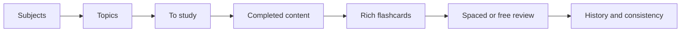

# Estuda Aqui

A study application built to plan what to learn, record what was studied, and review it at the right time.

[Português](README.md) | **English**

[](https://github.com/anamsilva1981/app-flash-card/actions/workflows/ci.yml)
[](https://angular.dev/)
[](https://www.typescriptlang.org/)
[](https://supabase.com/)
[](https://www.cypress.io/)

[Open the application](https://anamsilva1981.github.io/app-flash-card/) · [View repository](https://github.com/anamsilva1981/app-flash-card)

<!-- Add the main screenshot here once public, reviewed product images are committed. -->

## About the project

Estuda Aqui organizes the learning cycle in the way that made sense to me: decide what to study, prioritize content, record learning, turn concepts into rich flashcards, review them at the right time, and follow consistency over time.

It started from a personal need. My study process was spread across notebooks, notes, summaries, questions, examples, learning materials, and flashcards. Part of my time was spent organizing all of it instead of studying. The application brings that process into one flow.

> Studying starts before the flashcard and continues after it.

## How it works



The product separates two moments that are often mixed together: organizing and learning new content, then retrieving that knowledge through review. History connects both stages and shows what happened each day.

## Product highlights

### Study does not start with the card

Each subject can have its own study days and topic queue. A topic supports priority, notes, and a material link; it can remain in the inbox or belong to a subject, and it moves from **To study** to **Studied** with its completion date recorded.

On the home page, decks scheduled for the day show the next topic and the number of pending items. The application therefore helps decide what to study — not only review what has already become a card.

### More than question and answer

Each flashcard can include:

- question and answer;
- additional explanation;
- practical example;
- **Think of it this way**, using an analogy or mental image.

The goal is to provide different ways to understand the same concept. Cards are created manually; the project does not use automatic AI generation.

### Review with context and freedom

Daily review gathers due cards and lets the user choose a deck, filter by topic, and limit a session to 10, 20, 30, or all cards. During a session, the user flips the card, opens its supporting content, follows session progress, and rates recall as **Again**, **Hard**, **Good**, or **Easy**.

The rating calculates the next review and progressively increases the interval. The oldest overdue cards come first. When no cards are due, **free review** is still available: it provides practice without changing the normal schedule.

## Features

### Plan

- create, edit, archive, and restore subjects/decks;
- define study days for each subject;
- organize topics by subject or keep them in an inbox;
- record priority, notes, and a material link;
- see the recommended next topic and separate pending from completed content.

### Learn and record

- mark topics as studied and preserve their completion date;
- automatically record learning activity;
- inspect content studied on each day;
- follow onboarding for the first deck, topic, routine, and card.

### Create retrievable knowledge

- create and edit flashcards by subject and topic;
- combine question, answer, explanation, example, and analogy;
- browse every card in a subject;
- validate essential fields before saving.

### Review

- follow the daily queue of due cards;
- review by deck and filter by topic;
- configure session size;
- rate recall on four levels;
- automatically schedule the next reviews;
- use free review without changing the schedule.

### Track

- browse a monthly activity calendar;
- distinguish learning days from review days;
- open a day to see exactly what was studied or reviewed;
- track active days, completed topics, and due cards;
- see the current study streak.

### Keep studying

- use the application without an account with local data;
- synchronize account studies with the backend;
- resume from local cache and retain pending changes when connectivity fails;
- export and import a validated backup of subjects, routine, topics, cards, progress, and history;
- recover compatible data from older versions saved on the device;
- choose reminder days and time, enable browser notifications, and export the routine to a calendar.

### Experience

- mobile-first interface with desktop support;
- Portuguese and English, with a persisted preference and an updated `lang` attribute;
- adaptive navigation, accessible labels, and states announced to assistive technology;
- focus-managed dialogs that close with `Esc`.

## Screenshots

No product screenshots are currently committed to the repository. The structure below is ready without creating broken references:

<!--
| Home and daily routine | Subjects and topics |
|---|---|
|  |  |

| Rich flashcard | Review |
|---|---|
|  |  |

| History and calendar | Mobile |
|---|---|
|  |  |
-->

## Architecture

The application is organized by domain, with automatically enforced boundaries:

```text
src/app
├── core
│   ├── application
│   ├── auth
│   ├── notifications
│   ├── persistence
│   └── state
├── features
│   ├── account
│   ├── cards
│   ├── history
│   ├── home
│   ├── progress
│   ├── review
│   ├── settings
│   ├── study-plan
│   └── subjects
└── shared
```

- **`features`** keeps each flow's presentation, application logic, and domain rules together. A feature consumes another feature only through its `public-api.ts`.
- **`core`** contains authentication, persistence, synchronization, state, and notifications. It does not depend on feature UI.
- **`shared`** contains models, pure rules, and reusable components without knowing `core` or `features`.
- **Facades** expose use-case-specific state and operations to views, reducing component coupling.
- **Stores** hold reactive state with Signals; capability adapters connect features to the persistence repository.
- **The shell** composes features exclusively through their public APIs.

The `check:architecture` script protects these boundaries and rejects new dependencies in the wrong direction. Detailed technical notes are available in [`docs/architecture.md`](docs/architecture.md).

## Engineering decisions

### Feature-oriented architecture

Concentrating rules in the main component would make independent evolution difficult. Feature boundaries keep each domain close to its views, facades, stores, and rules, while public APIs make dependencies explicit.

### Authorization at the data layer

The UI is not treated as a security boundary. Authenticated studies are tied to `user_id`; Row Level Security and `auth.uid()` policies restrict reads and writes to the owning user.

### Idempotent operations and atomic imports

Synchronized changes carry operation identifiers so retries can be handled safely. Backup import applies a batch inside one transaction: an error prevents partial replacement of user data.

### Continuity through cache and synchronization

Network interruptions should not erase study context. Local state can restore available data, while an operation queue retains changes until synchronization can continue and exposes its status in the UI.

### Free review separated from scheduling

Practicing outside the queue should neither bring the next review forward nor postpone it. Free review cycles through cards without persisting a new due date; only scheduled review updates intervals.

### Layered tests

Pure rules, components, backend integration, and full journeys fail in different ways. The suite combines unit tests, colocated specs, disposable Supabase, and Cypress so each level is protected without relying only on E2E tests.

### Internationalization as application state

Portuguese and English share a typed message catalog. The selection is persisted and updates the document `lang` attribute, keeping the interface and page metadata aligned.

## Security and privacy

- authentication and sessions through Supabase Auth;
- RLS on current account data with policies based on `auth.uid()`;
- anonymous access revoked from current private structures;
- a publishable key in the frontend, with no `service_role` in client code;
- an authenticated Edge Function that revokes sessions and deletes the account;
- explicit confirmation before account and data deletion;
- privacy policy and backup export available in the application.

These measures reduce exposure and reinforce account isolation without replacing a specialized security audit.

## Quality and testing

The strategy covers different responsibilities:

- **unit tests:** domain rules, persistence, synchronization, lifecycle, and account behavior;
- **colocated specs:** components, facades, stores, services, repositories, and navigation;
- **integration:** persistence, user isolation, rollback, idempotency, and deletion against disposable local Supabase;
- **Cypress E2E:** authentication, onboarding, navigation, subjects, topics, flashcards, review, history, settings, and account;
- **structural checks:** enforce architecture boundaries and require specs for selected units.

Coverage requires at least 80% lines, 80% statements, 70% branches, and 70% functions.

```bash
npm test
npm run test:components
npm run test:coverage
npm run test:integration
npm run e2e
npm run e2e:blocks
npm run check:architecture
npm run check:test-structure
npm run lint
npm run format:check
npm run build
```

## CI/CD

Pull requests run through a GitHub Actions quality gate:

```text
npm ci
  ↓
formatting and lint
  ↓
architecture boundaries and test structure
  ↓
colocated specs
  ↓
build and coverage
  ↓
Cypress E2E

In parallel:
disposable Supabase → integration tests → real-browser persistence
```

On `main`, another workflow repeats formatting, lint, build, coverage, and E2E before publishing the artifact to GitHub Pages.

## Stack

| Category         | Technology                   |
| ---------------- | ---------------------------- |
| Front end        | Angular 20                   |
| Language         | TypeScript 5.9               |
| UI               | Angular Material / CDK       |
| Reactivity       | Angular Signals and RxJS     |
| Backend          | Supabase                     |
| Database         | PostgreSQL                   |
| Authentication   | Supabase Auth                |
| Authorization    | Row Level Security           |
| Backend function | Supabase Edge Functions      |
| Testing          | Node Test Runner and Cypress |
| Coverage         | c8                           |
| Quality          | ESLint and Prettier          |
| CI/CD            | GitHub Actions               |
| Deployment       | GitHub Pages                 |

## Run locally

### Requirements

- Node.js 22 or newer;
- npm;
- a Supabase project configured for authenticated flows.

```bash
git clone https://github.com/anamsilva1981/app-flash-card.git
cd app-flash-card
npm install
```

Create the local environment file from the example:

```bash
cp .env.example .env
```

On PowerShell:

```powershell
Copy-Item .env.example .env
```

Fill in public and configuration values only:

```text
SUPABASE_URL
SUPABASE_PUBLISHABLE_KEY
APP_OWNER_NAME
APP_SUPPORT_URL
APP_PRIVACY_UPDATED_AT
```

Never place `service_role`, passwords, or administrative tokens in frontend configuration.

```bash
npm start
```

The `prestart` script generates public configuration before starting the server. By default, the application is available at `http://localhost:4200`.

## Author

**Ana Maria Silva**

Front-end Developer

[GitHub](https://github.com/anamsilva1981) · [Repository](https://github.com/anamsilva1981/app-flash-card)

## Project scope

This is a personal portfolio project created around a real study process and used to exercise product and front-end engineering decisions. It is not a commercial product.
