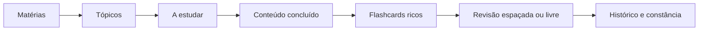

# Estuda Aqui

Uma aplicação de estudos criada para planejar o que aprender, registrar o que foi estudado e revisar no momento certo.

**Português** | [English](README.en.md)

[](https://github.com/anamsilva1981/app-flash-card/actions/workflows/ci.yml)
[](https://angular.dev/)
[](https://www.typescriptlang.org/)
[](https://supabase.com/)
[](https://www.cypress.io/)

[Acessar aplicação](https://anamsilva1981.github.io/app-flash-card/) · [Ver repositório](https://github.com/anamsilva1981/app-flash-card)

<!-- Adicione aqui a captura principal quando houver imagens públicas e revisadas no repositório. -->

## Sobre o projeto

O Estuda Aqui organiza o ciclo de aprendizagem do jeito que fazia sentido para mim: decidir o que estudar, priorizar conteúdos, registrar o aprendizado, transformar conceitos em flashcards ricos, revisar no momento adequado e acompanhar a constância ao longo do tempo.

Ele nasceu de uma necessidade pessoal. Meu estudo ficava distribuído entre cadernos, anotações, resumos, perguntas, exemplos, materiais e flashcards. Parte do tempo acabava sendo usada para organizar tudo isso, em vez de estudar. A aplicação reúne esse processo em um único fluxo.

> Estudar começa antes do flashcard e continua depois dele.

## Como funciona



O produto separa dois momentos que costumam se misturar: organizar e aprender conteúdo novo; depois recuperar esse conhecimento por meio de revisões. O histórico conecta as duas etapas e mostra o que aconteceu em cada dia.

## Diferenciais do produto

### O estudo não começa no card

Cada matéria pode ter dias próprios de estudo e uma fila de tópicos. Um tópico aceita prioridade, observação e link para o material, pode ficar na caixa de entrada ou dentro de uma matéria e passa de **A estudar** para **Estudados** com a data de conclusão registrada.

Na página inicial, os baralhos previstos para o dia mostram o próximo tópico e a quantidade de pendências. Assim, a aplicação também ajuda a decidir o que estudar — não apenas a revisar o que já foi transformado em card.

### Mais do que pergunta e resposta

Cada flashcard pode reunir:

- pergunta e resposta;
- explicação adicional;
- exemplo prático;
- **Pensa assim**, com uma analogia ou imagem mental.

A intenção é oferecer diferentes caminhos para compreender o mesmo conceito. Os cards são criados manualmente; o projeto não usa geração automática por IA.

### Revisão com contexto e liberdade

A revisão diária reúne os cards pendentes, permite escolher o baralho, filtrar por tópico e limitar a sessão a 10, 20, 30 ou todos os cards. Durante a sessão, o usuário vira o card, consulta os conteúdos complementares, acompanha o progresso e avalia a lembrança como **Não sei**, **Difícil**, **Sei** ou **Fácil**.

Essa avaliação calcula a próxima revisão e aumenta progressivamente o intervalo. Cards vencidos há mais tempo aparecem primeiro. Quando não existem cards pendentes, ainda é possível iniciar uma **revisão livre**: ela permite praticar sem alterar o agendamento normal.

## Funcionalidades

### Planejar

- criar, editar, arquivar e restaurar matérias/baralhos;
- definir dias de estudo por matéria;
- organizar tópicos por matéria ou mantê-los em uma caixa de entrada;
- registrar prioridade, observação e link para o material;
- consultar o próximo tópico recomendado e separar conteúdos pendentes dos concluídos.

### Aprender e registrar

- marcar tópicos como estudados e preservar sua data de conclusão;
- registrar automaticamente atividades de aprendizado;
- consultar o conteúdo estudado por dia;
- seguir um onboarding para configurar baralho, tópico, rotina e primeiro card.

### Criar conhecimento recuperável

- criar e editar flashcards por matéria e tópico;
- combinar pergunta, resposta, explicação, exemplo e analogia;
- consultar todos os cards de uma matéria;
- validar os campos essenciais antes de salvar.

### Revisar

- acompanhar a fila diária de cards pendentes;
- revisar por baralho e filtrar por tópico;
- configurar o tamanho da sessão;
- avaliar a lembrança em quatro níveis;
- agendar automaticamente as próximas revisões;
- praticar em revisão livre sem modificar o cronograma.

### Acompanhar

- navegar por um calendário mensal de atividades;
- diferenciar dias de aprendizado e de revisão;
- abrir um dia para ver exatamente o que foi estudado ou revisado;
- acompanhar dias com atividade, tópicos concluídos e cards pendentes;
- visualizar a sequência atual de dias estudando.

### Continuar estudando

- usar o aplicativo sem conta com dados locais;
- sincronizar os estudos de uma conta com o backend;
- continuar a partir do cache local e manter alterações pendentes quando a conexão falha;
- exportar e importar backup validado de matérias, rotina, tópicos, cards, progresso e histórico;
- recuperar dados compatíveis de versões anteriores salvos no dispositivo;
- escolher horário e dias para lembretes, ativar avisos do navegador e exportar a rotina para o calendário.

### Experiência

- interface mobile-first com suporte a desktop;
- português e inglês, com preferência persistida e atributo `lang` atualizado;
- navegação adaptada, labels acessíveis e estados anunciados por tecnologias assistivas;
- modais com controle de foco e fechamento pela tecla `Esc`.

## Screenshots

Ainda não há capturas de produto versionadas no repositório. A estrutura abaixo fica preparada sem criar referências quebradas:

<!--
| Home e rotina diária | Matérias e tópicos |
|---|---|
|  |  |

| Flashcard rico | Revisão |
|---|---|
|  |  |

| Histórico e calendário | Mobile |
|---|---|
|  |  |
-->

## Arquitetura

A aplicação adota organização por domínio, com limites verificados automaticamente:

```text
src/app
├── core
│   ├── application
│   ├── auth
│   ├── notifications
│   ├── persistence
│   └── state
├── features
│   ├── account
│   ├── cards
│   ├── history
│   ├── home
│   ├── progress
│   ├── review
│   ├── settings
│   ├── study-plan
│   └── subjects
└── shared
```

- **`features`** concentra apresentação, aplicação e regras do domínio de cada fluxo. Uma feature consome outra somente por seu `public-api.ts`.
- **`core`** reúne autenticação, persistência, sincronização, estado e notificações. Ele não depende da interface das features.
- **`shared`** contém modelos, regras puras e componentes reutilizáveis, sem conhecer `core` ou `features`.
- **Facades** expõem às telas operações e estado próprios de cada caso de uso, reduzindo o acoplamento dos componentes.
- **Stores** mantêm estado reativo com Signals; adapters de capacidade conectam as features ao repositório de persistência.
- **O shell** compõe as features exclusivamente pelas APIs públicas.

O script `check:architecture` protege essas fronteiras e impede novas dependências na direção errada. A documentação detalhada está em [`docs/architecture.md`](docs/architecture.md).

## Decisões de engenharia

### Arquitetura orientada a features

Concentrar as regras no componente principal dificultaria a evolução independente. A divisão por features mantém cada domínio próximo de suas telas, facades, stores e regras, enquanto APIs públicas tornam as dependências explícitas.

### Autorização na camada de dados

A interface não é tratada como fronteira de segurança. Os estudos de contas autenticadas ficam associados ao `user_id`; Row Level Security e políticas baseadas em `auth.uid()` restringem leitura e escrita ao próprio usuário.

### Operações idempotentes e importação atômica

Alterações sincronizadas recebem identificadores de operação para tolerar reenvios. A importação de backup usa uma operação em lote dentro de uma transação: um erro impede a substituição parcial dos dados.

### Continuidade com cache e sincronização

Interrupções de rede não devem apagar o contexto de estudo. O estado local permite reabrir dados disponíveis e a fila de operações preserva alterações até que a sincronização possa continuar, com estados visíveis na interface.

### Revisão livre separada do agendamento

Praticar fora da fila não deveria antecipar nem adiar a próxima revisão. Por isso, a revisão livre percorre os cards sem persistir uma nova data; apenas a revisão programada atualiza o intervalo.

### Testes em camadas

Regras puras, componentes, integração com o backend e jornadas completas falham de formas diferentes. A suíte combina testes unitários, specs colocalizados, Supabase descartável e Cypress para proteger cada nível sem depender apenas de E2E.

### Internacionalização como estado da aplicação

Português e inglês compartilham um catálogo tipado de mensagens. A escolha fica persistida e também atualiza o atributo `lang`, mantendo interface e documento alinhados.

## Segurança e privacidade

- autenticação e sessão por Supabase Auth;
- RLS nos dados atuais por conta, com políticas baseadas em `auth.uid()`;
- acesso anônimo revogado das estruturas privadas atuais;
- chave publicável no frontend, sem `service_role` no cliente;
- Edge Function autenticada para revogar sessões e excluir a conta;
- confirmação explícita antes da exclusão de conta e dados;
- política de privacidade e exportação de backup acessíveis pela aplicação.

Essas medidas reduzem exposição e reforçam o isolamento entre contas, sem substituir auditorias especializadas de segurança.

## Qualidade e testes

A estratégia cobre responsabilidades diferentes:

- **unitários:** regras de domínio, persistência, sincronização, ciclo de vida e conta;
- **specs colocalizados:** componentes, facades, stores, serviços, repositórios e navegação;
- **integração:** persistência, isolamento entre usuários, rollback, idempotência e exclusão contra um Supabase local descartável;
- **E2E com Cypress:** autenticação, onboarding, navegação, matérias, tópicos, flashcards, revisão, histórico, configurações e conta;
- **checks estruturais:** validam fronteiras arquiteturais e exigem specs para as unidades selecionadas.

O comando de cobertura exige no mínimo 80% de linhas, 80% de statements, 70% de branches e 70% de funções.

```bash
npm test
npm run test:components
npm run test:coverage
npm run test:integration
npm run e2e
npm run e2e:blocks
npm run check:architecture
npm run check:test-structure
npm run lint
npm run format:check
npm run build
```

## CI/CD

Pull requests passam por um quality gate no GitHub Actions:

```text
npm ci
  ↓
formatação e lint
  ↓
fronteiras de arquitetura e estrutura de testes
  ↓
specs colocalizados
  ↓
build e cobertura
  ↓
Cypress E2E

Em paralelo:
Supabase descartável → testes de integração → persistência em navegador real
```

Na branch `main`, outro workflow repete formatação, lint, build, cobertura e E2E antes de publicar o artefato no GitHub Pages.

## Stack

| Categoria         | Tecnologia                 |
| ----------------- | -------------------------- |
| Front-end         | Angular 20                 |
| Linguagem         | TypeScript 5.9             |
| UI                | Angular Material / CDK     |
| Reatividade       | Angular Signals e RxJS     |
| Backend           | Supabase                   |
| Banco             | PostgreSQL                 |
| Autenticação      | Supabase Auth              |
| Autorização       | Row Level Security         |
| Função de backend | Supabase Edge Functions    |
| Testes            | Node Test Runner e Cypress |
| Cobertura         | c8                         |
| Qualidade         | ESLint e Prettier          |
| CI/CD             | GitHub Actions             |
| Deploy            | GitHub Pages               |

## Executar localmente

### Requisitos

- Node.js 22 ou superior;
- npm;
- um projeto Supabase configurado para os fluxos autenticados.

```bash
git clone https://github.com/anamsilva1981/app-flash-card.git
cd app-flash-card
npm install
```

Crie o arquivo local de ambiente a partir do exemplo:

```bash
cp .env.example .env
```

No PowerShell:

```powershell
Copy-Item .env.example .env
```

Preencha apenas valores públicos e de configuração:

```text
SUPABASE_URL
SUPABASE_PUBLISHABLE_KEY
APP_OWNER_NAME
APP_SUPPORT_URL
APP_PRIVACY_UPDATED_AT
```

Nunca coloque `service_role`, senhas ou tokens administrativos no frontend.

```bash
npm start
```

O script `prestart` gera a configuração pública antes de iniciar o servidor. Por padrão, a aplicação fica em `http://localhost:4200`.

## Autora

**Ana Maria Silva**

Desenvolvedora Front-end

[GitHub](https://github.com/anamsilva1981) · [Repositório](https://github.com/anamsilva1981/app-flash-card)

## Natureza do projeto

Este é um projeto pessoal e de portfólio, criado a partir de um processo real de estudos e usado para exercitar decisões de produto e engenharia front-end. Não é um produto comercial.
